# Dupin — Real-Time Transaction Fraud Scoring

Sistema de scoring de riesgo de fraude transaccional en tiempo real. Dada una
transacción dentro de un flujo de operaciones, emite un score continuo, una
decisión (`approve` / `review` / `block`) y la razón explícita del flag, con
latencia medida bajo carga.

**Estado:** prototipo v0.1 · modelo `m-v1` · features `feat-v1`
**Stack:** GCP (GCS + Colab + Cloud Run) · gradient boosting tabular · FastAPI · dashboard en vivo

> El foco del proyecto no es el clasificador sino el régimen de evaluación. El
> resultado principal es el gap entre la métrica optimista y la desplegable,
> descompuesto en sus dos causas: fuga de etiqueta y fuga temporal.

---

## Pregunta del proyecto

> Dada una transacción de dinero móvil dentro de un flujo temporal, ¿se puede
> predecir si es fraudulenta usando solo información de comportamiento disponible
> *antes* del instante de la transacción, y cuánto se degrada ese rendimiento al
> evaluar con split temporal honesto en lugar del split aleatorio optimista —y
> cuánto del rendimiento aparente de los enfoques ingenuos es fuga de etiqueta de
> las columnas de balance?

**Resultado que se cuenta:** el gap entre el número ingenuo/optimista y el
honesto/desplegable, descompuesto en (1) fuga de etiqueta y (2) fuga temporal.

---

## Dataset, licencia y atribución

Construido sobre **PaySim**, un simulador público de transacciones de dinero
móvil. Datos sintéticos: la metodología es el valor, no el número absoluto.

- **Atribución (CC BY):** Lopez-Rojas, E. A., Elmir, A., & Axelsson, S. (2016).
  *PaySim: A financial mobile money simulator for fraud detection.* En *The 28th
  European Modeling and Simulation Symposium (EMSS)*, Larnaca, Cyprus.
- **Fuente:** Kaggle — [`ealaxi/paysim1`](https://www.kaggle.com/datasets/ealaxi/paysim1)
- **Licencia del dataset:** CC BY-SA 4.0.

**ShareAlike, en claro:** el SA aplica a redistribuciones del dataset o derivados
del dato. **No** aplica a este código, al modelo entrenado ni al dashboard, que
lo consumen pero no son el dato. Por eso: el CSV de PaySim **nunca** entra al
repo (vive en GCS + Kaggle), se atribuye la fuente, y el código va bajo licencia
MIT. Los datos y secretos quedan fuera de git (ver [`.gitignore`](.gitignore)).

### La trampa de las columnas de balance

La documentación de PaySim advierte que las transacciones fraudulentas son
*anuladas*, por lo que `oldbalanceOrg`, `newbalanceOrig`, `oldbalanceDest` y
`newbalanceDest` **codifican el etiquetado**. Usarlas crudas da AUC ~0.99 que es
fuga de etiqueta, no detección. Dupin las prohíbe como features crudas, lo
demuestra en la Fase 1 y lo audita en la Fase 3. Ese error, común en notebooks de
Kaggle, es uno de los dos ejes del resultado.

---

## Estructura del repositorio

```
dupin/
├── data/
│   ├── download/colab_ingest.ipynb   # ingesta Kaggle→GCS (sin pasar por local)
│   ├── schema.py                     # esquema tipado de la transacción cruda
│   └── splits.py                     # cortes temporales (Fase 3)
├── notebooks/                        # 01 exploración · 02 features · 03 eval · 04 train
├── features/                         # Fase 2 — transacción→vector, sin fuga (+ tests)
├── training/                         # Fase 4 — train + model + bundle (+ tests)
├── evaluation/                       # Fase 3 — métricas, splits, leakage_audit (+ tests)
├── serving/                          # Fase 5 — FastAPI, runtime, explain, Dockerfile (+ tests)
├── infra/                            # 00-04 scripts GCP (apis, buckets, AR, SA, deploy)
├── docs/                             # findings por fase + model card
├── cloudbuild.yaml · config.example.yaml · pyproject.toml
```

---

## Estado por fase

| Fase | Descripción | Estado |
|------|-------------|--------|
| 0 | Dataset, licencia, pregunta, GCP | Completa |
| 1 | Exploración y entendimiento del fraude | Completa — [docs/phase1_findings.md](docs/phase1_findings.md) |
| 2 | Features de comportamiento | Completa — matriz en `gs://dupin-dupin-features/feat-v1/` (2.77M filas) |
| 3 | Régimen de evaluación honesto | Completa — [docs/phase3_findings.md](docs/phase3_findings.md) |
| 4 | Modelado | Completa — LightGBM, bundle `m-v1` ([docs/phase4_findings.md](docs/phase4_findings.md)) |
| 5 | Serving end-to-end | Desplegado en Cloud Run · FastAPI `/v1/score` |
| 6 | Dashboard en vivo | Desplegado · consola same-origin (stream, KPIs, umbral) |
| 7 | Empaquetado y narrativa | Completa — [model card](docs/model_card_m-v1.md) |

---

## Resultados (m-v1)

Lo que se reporta es el gap entre la métrica optimista y la desplegable, no el AUC.
Punto de operación: revisar como máximo el 1% de las operaciones.

| Configuración | Recall | Precision | Nota |
|---|---|---|---|
| Balance crudo + split aleatorio | 99.8% | — | columnas con fuga + orden aleatorio |
| Honesto + split temporal (desplegable) | 35.3% | 75.4% | a presupuesto de revisión completo |
| Tier de auto-block | 1.74% | 100% | sin falsos positivos |

Envolvente sobre el test temporal: ~54% de recall al 2% de revisión, ~78% al 5%.
PR-AUC temporal 0.594 (≈28× la tasa base). El gap del 99.8% al 35.3% se descompone
en fuga de etiqueta (columnas de balance) y fuga temporal (split aleatorio vs.
temporal). Detalle en [phase3_findings](docs/phase3_findings.md) y
[phase4_findings](docs/phase4_findings.md).

---

## Alcance y limitaciones

- **Dato sintético.** Entrenado y evaluado sobre PaySim. Los patrones sintéticos
  son más simples y separables que el fraude real, así que las métricas absolutas
  no se transfieren a producción. Esto no es un modelo de producción; el aporte es
  la metodología.
- **Sin grafos de entidades** (v1 es tabular por entidad individual).
- **Scoring por transacción, no por sesión.**
- **Umbral único global**, sin segmentación por cliente o canal.
- **Estado cold-start en serving** (en producción iría sobre un feature store).

Detalle completo en la [model card](docs/model_card_m-v1.md).

---

## El proceso en imágenes

### Fase 1 — Exploración del fraude

El dataset crudo de PaySim. Ya en las primeras filas se nota el problema: las
transacciones de fraude (`isFraud=1`, filas TRANSFER/CASH_OUT) tienen
`newbalanceOrig = 0`, la cuenta vaciada. Eso es la fuga de etiqueta en las columnas
de balance.

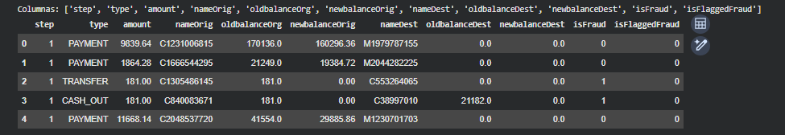

El fraude vive **solo** en TRANSFER y CASH_OUT (cero en PAYMENT/DEBIT/CASH_IN):
un filtro estructural que define la superficie de scoring.

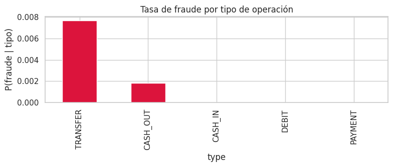

Los montos de fraude se desplazan a la derecha (importes mayores) frente a los
legítimos, pero con fuerte solapamiento: el monto solo no separa.

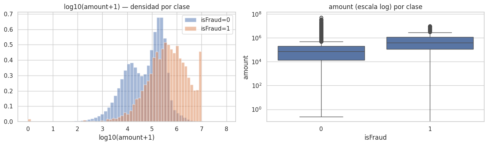

Firma horaria: el volumen legítimo es diurno, pero el fraude se concentra en la
madrugada (3–6h), desalineado del tráfico normal.

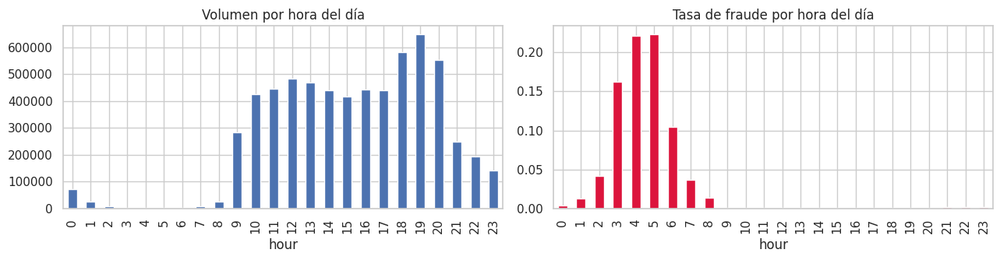

Estructura temporal sobre los 744 steps (30 días): el volumen se concentra al
principio y cae en la cola, mientras el fraude aparece a lo largo de todo el
rango. Por eso el corte temporal es viable.

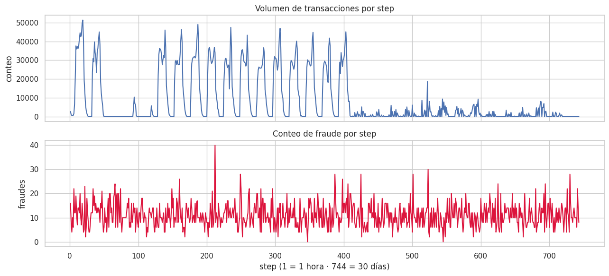

### Fase 2 — Matriz de features `feat-v1`

Verificación de la matriz: 2.77M filas en la superficie, tasa base 0.30%, sin NaN
y sin columnas de balance. El `describe()` confirma que los receptores tienen
historia (`dest_prior_count` media 7.7) mientras `orig_prior_count` es casi cero
(los originadores son de un solo uso): de ahí el pivote a `nameDest`.

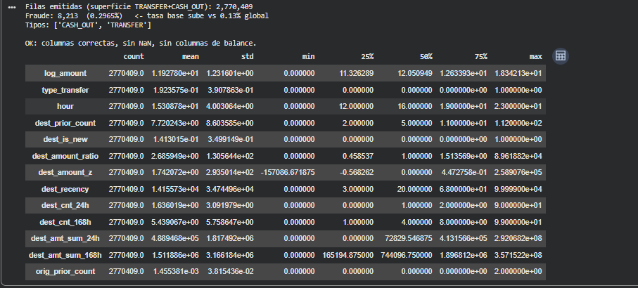

### Fase 3 — Evaluación honesta

La misma capacidad del modelo medida con split aleatorio (optimista) vs. temporal
(honesto). La separación entre las dos curvas a recall medio-alto es el optimismo
que introduce el split aleatorio.

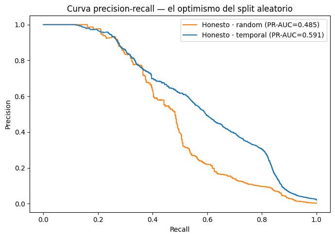

### Fase 4 — Envolvente del modelo final

LightGBM sobre el test temporal: cuánto fraude se atrapa según el presupuesto de
revisión. A 1% se atrapa ~35%, a 5% ~78%.

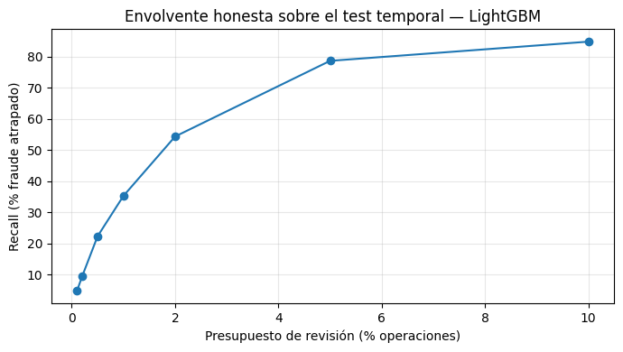

### Fases 5–6 — Serving y dashboard de monitoreo

El modelo se sirve en Cloud Run con un dashboard de monitoreo: stream de
transacciones coloreado por decisión, score como medidor, panel de razones
(atribución real del modelo · ▲ sube el riesgo / ▼ lo baja) y control de umbral
interactivo. Latencia ~15–20 ms por transacción. *(Demo en iteración.)*

**Flujo normal.** La mayoría se aprueba sin fricción; el panel explica cada
decisión por la contribución del modelo a ese score.

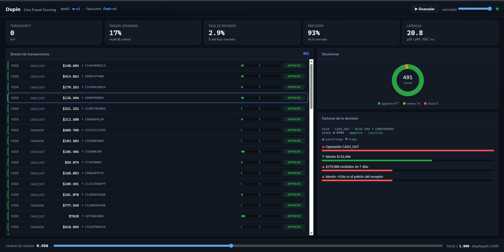

**Fraude atrapado.** Un CASH_OUT de $951k marcado para revisión, con los factores
que lo elevaron: monto, tipo de operación y desviación frente al patrón del
receptor. Precisión 100% en ese punto de operación.

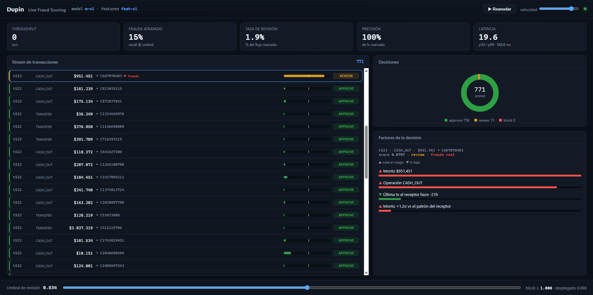

**El caso difícil.** $5.566.368 a una cuenta sin historial, a las 22h → REVIEW
(score 0.997). El panel dice por qué: receptor nuevo + monto + hora.

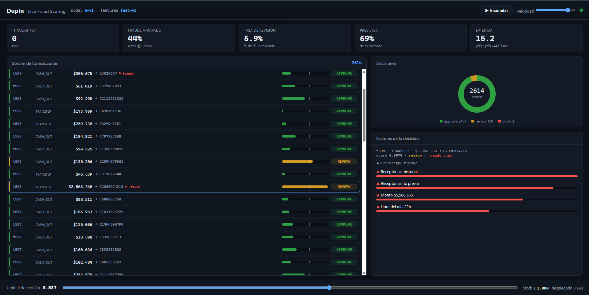

**Honestidad: también se equivoca.** Un legítimo de $686k a las 21h, +2.5σ sobre
el patrón del receptor, va a revisión (falso positivo). El dashboard lo muestra,
no lo esconde.

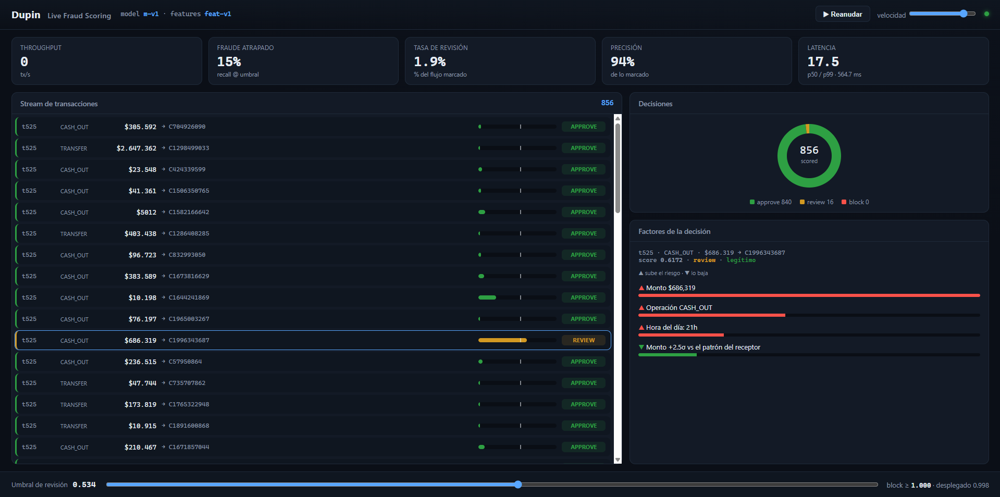

**Punto de operación agresivo.** Bajando el umbral se atrapa más fraude (aquí
61%) a costa de revisar más operaciones (9.9%): el trade-off recall vs. carga
operativa, tangible y en vivo.

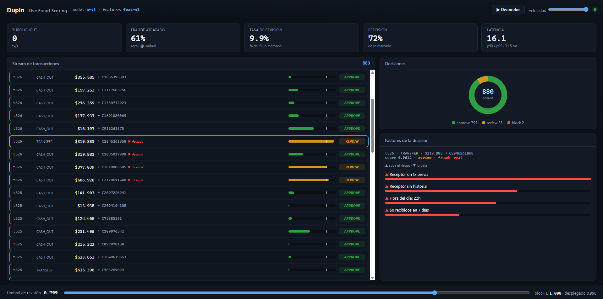

---

## API de scoring

El servicio expone un endpoint de scoring y sirve el **dashboard de monitoreo**
same-origin desde su raíz (stream coloreado por decisión, score como medidor,
panel de razones, KPIs de recall/precisión/latencia, y control de umbral
interactivo). Cloud Run, escala a cero.

`POST /v1/score` — transacción cruda → score + decisión + razón legible + latencia:

```bash
curl -X POST localhost:8080/v1/score -H 'Content-Type: application/json' -d '{
  "step": 500, "type": "TRANSFER", "amount": 181000.0,
  "nameOrig": "C840083671", "nameDest": "C38997010"
}'
# → {"score":0.97,"decision":"block","scorable":true,
#    "reasons":[{"feature":"dest_amount_ratio","message":"Monto 12.4× el promedio histórico del receptor",...}],
#    "latency_ms":3.1,"model_version":"m-v1","feature_version":"feat-v1"}
```

Otros: `GET /health` (estado + modelo cargado), `GET /version`, `GET /docs` (OpenAPI).
El serving usa el **mismo `features/`** del entrenamiento (paridad) y rechaza
arrancar si falta un componente del bundle.

```bash
# Local
export DUPIN_BUNDLE_URI=gs://dupin-dupin-artifacts/m-v1   # o ruta local
uvicorn serving.app:app --reload
```

---

## Setup

```bash
cp config.example.yaml config.yaml          # configuración

# Plano offline (Colab): ingesta → features → evaluación → modelo
#   data/download/colab_ingest.ipynb     → PaySim a gs://dupin-dupin-raw/
#   notebooks/01_fraud_exploration.ipynb → caracterización (Fase 1)
#   notebooks/02_build_features.ipynb    → matriz feat-v1 (Fase 2)
#   notebooks/03_evaluate.ipynb          → gap honesto (Fase 3)
#   notebooks/04_train.ipynb             → bundle m-v1 (Fase 4)

# Plano online (Cloud Run): build + deploy del serving
export PROJECT_ID=dupin-dupin
bash infra/00_enable_apis.sh
bash infra/01_buckets.sh
bash infra/02_artifact_registry.sh
bash infra/03_service_accounts.sh
bash infra/04_deploy.sh                       # verifica el bundle y despliega

# Tests
python -m pytest -q
```

GCP: proyecto `dupin-dupin`, alerta de presupuesto activa.
